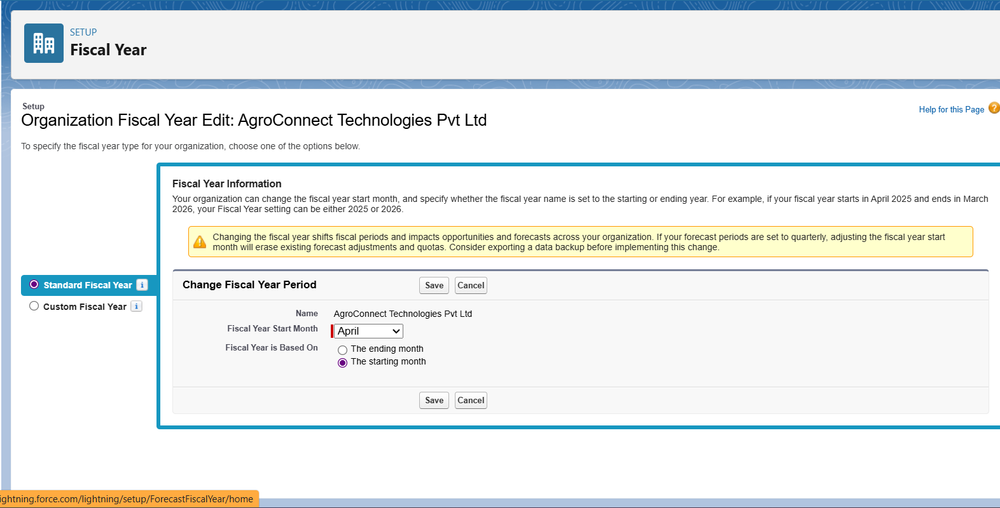
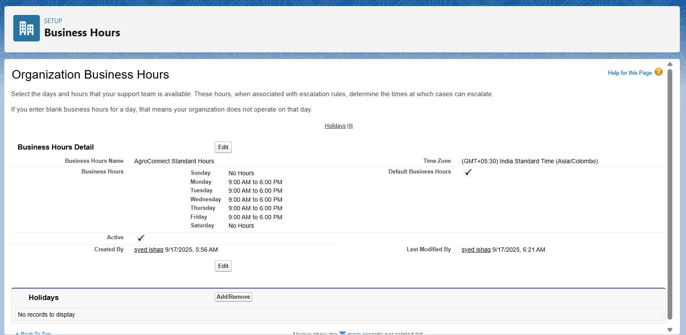
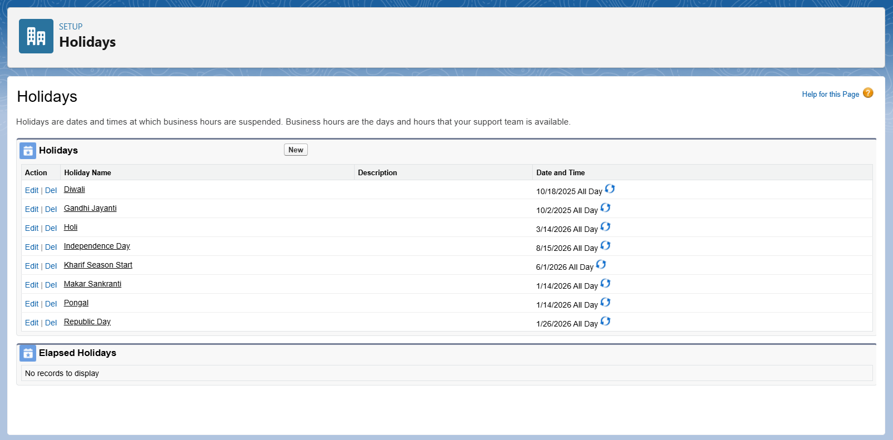
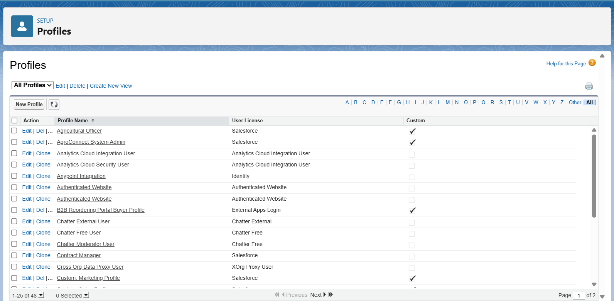
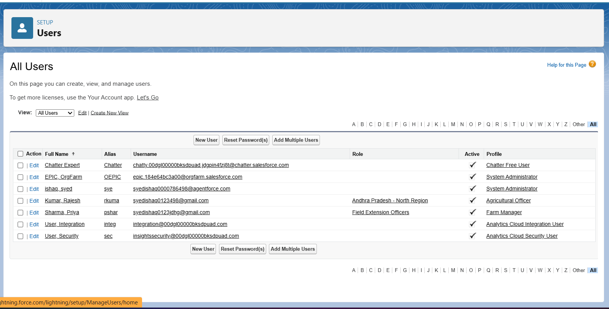
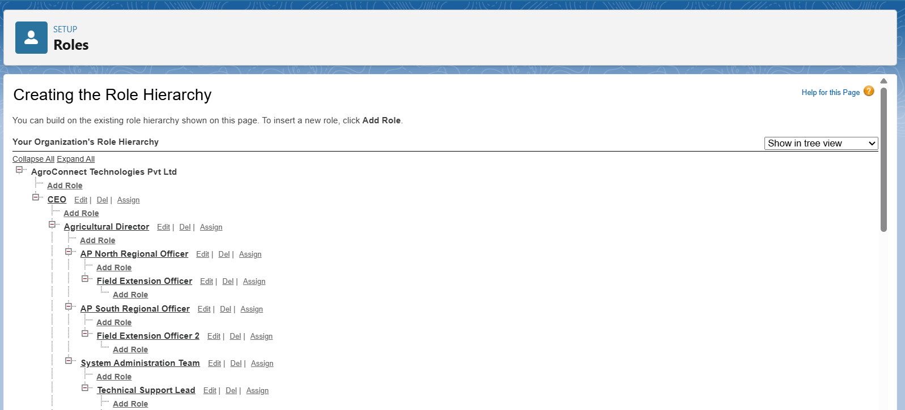
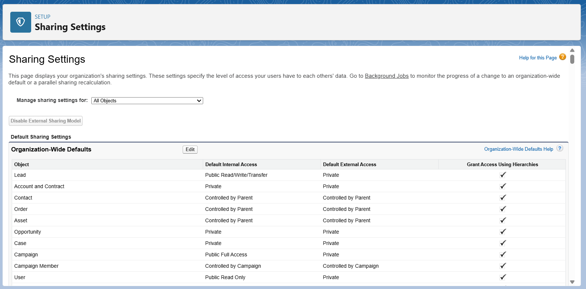
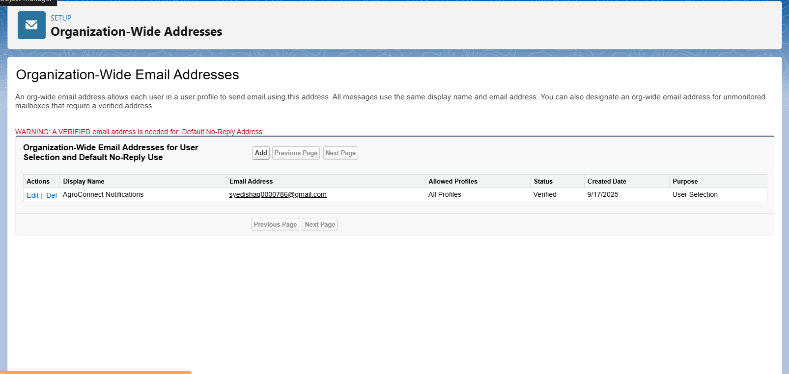

# AgroConnect Pro - Phase 2 Documentation  
## Org Setup and Configuration (Completed)

**Project Title:** AgroConnect Pro - Smart Agriculture Management System for Indian Farmers  
**Developer:** Syed Ishaq - TCS LastMile Phase 2 Participant  
**Date:** September 18, 2025

---

## **PHASE 2: ORG SETUP AND CONFIGURATION**

This document records the completed Salesforce org configurations as implemented according to the mentor-approved plan for AgriConnect Pro.

---

### 1. Salesforce Developer Edition Setup Completed
**Org Configuration:**
- Developer Edition org created and activated
- Org alias: `agroconnect_dev` 
- Org URL: [Your-org-URL].lightning.force.com
- Metadata retrieval and GitHub integration verified


---

### 2. Company Profile Setup Completed

**Company Information Configured:**
- Company Name: AgroConnect Technologies Pvt Ltd
- Industry: Agriculture & Food Production  
- Address: Technology Hub, Kadapa, Andhra Pradesh, 516001, India
- Phone: +91-8562-XXXXXX
- Website: www.agroconnect-pro.com

**Screenshot Navigation:** Setup → Company Information → Edit
*Take screenshot of completed company profile showing all details*


**Locale & Currency Settings:**
- Locale: English (India)  
- Time Zone: IST (GMT+05:30)
- Currency: INR (₹)
- Date Format: DD/MM/YYYY

**Screenshot Navigation:** Setup → Company Information → Localization
*Take screenshot showing time zone and currency settings*

---

### 3. Fiscal Year Configuration Completed

**Settings Applied:**
- Fiscal Year: Standard (April – March) aligned with Indian government fiscal year
- Start Month: April
- Naming Convention: FY YYYY-YY (e.g., FY 2025-26)  
- Week Start Day: Monday (Indian business standard)


**Screenshot Navigation:** Setup → Company Information → Fiscal Year
*Take screenshot of fiscal year settings page*

---

### 4. Business Hours & Holidays Setup Completed

**Standard Business Hours Created:**
- Business Hours Name: "AgroConnect Standard Hours"  
- Monday–Friday: 9:00 AM to 6:00 PM IST
- Saturday: Closed
- Sunday: Closed
- Active: ✓ 
- Use these business hours as the default: ✓

**Screenshot Navigation:** Setup → Business Hours → New
*Take screenshot of business hours configuration screen as shown in your image*


**Holiday Calendar Configured:**
- National holidays: Republic Day (Jan 26), Independence Day (Aug 15), Gandhi Jayanti (Oct 2)
- Regional festivals: Diwali, Holi, Pongal, Makar Sankranti
- Agricultural important dates: Kharif season start, Rabi season start

**Screenshot Navigation:** Setup → Holidays → New
*Take screenshot showing holiday list*

---

### 5. User Management and Profiles Setup Completed

**Custom Profiles Created:**
1. **AgroConnect System Admin**
   - Full system access for configuration and maintenance
   - All objects: Create, Read, Edit, Delete permissions
   - Administrative permissions enabled

2. **Agricultural Officer** 
   - Read/Edit farmer and farm data
   - Access to analytics and reports
   - Scheme management permissions

3. **Farm Manager**
   - Manage owned farms and crop cycles
   - Limited create/edit permissions on farming objects
   - No administrative access

4. **Farmer Community User**
   - Access own farm data through Community
   - Create support cases
   - Read-only access to scheme information

5. **Service Provider Community**
   - Manage service catalogs
   - Respond to farmer support cases
   - Limited data access

**Screenshot Navigation:** Setup → Profiles → New Profile
*Take screenshot of profile creation and permission settings*


**Users Created and Assigned:**
- Rajesh Kumar: Agricultural Officer profile, AP North role
- Priya Sharma: Farm Manager profile, Field Extension Officer role  

**Screenshot Navigation:** Setup → Users → New User  
*Take screenshot of user creation form*


---

### 6. Role Hierarchy Established

**Hierarchy Structure Implemented:**
```
Agricultural Director
├─ AP North Regional Officer  
│   └─ Field Extension Officer
├─ AP South Regional Officer
│   └─ Field Extension Officer  
└─ System Administrator
    └─ Technical Support
```

**Screenshot Navigation:** Setup → Roles → Set Up Roles
*Take screenshot of role hierarchy tree view*


---

### 7. Organization-Wide Defaults (OWD) Configured

**Access Settings Applied:**

| Object | Internal Access | External Access | Justification |
|--------|----------------|-----------------|---------------|
| Account (Farmers) | Private | Private | Farmer data confidentiality |
| Contact | Controlled by Parent | Controlled by Parent | Follow Account sharing |
| Opportunity | Private | No Access | Business sensitive deals |
| Case | Private | Private | Support case privacy |

**Note:** Farm__c and Crop_Cycle__c OWD settings configured in Phase 3 as these objects were created in data modeling phase.

**Screenshot Navigation:** Setup → Sharing Settings → Organization-Wide Defaults
*Take screenshot of OWD settings table*


---

### 8. Permission Sets Created  

**Permission Sets Configured:**

**Market Data Access**
- Purpose: Read access to market price objects and dashboards
- Assigned to: Officers & Managers  
- Permissions: Read on Market_Price_Alert__c, Dashboard access

**Mobile Agriculture App**  
- Purpose: Offline access, photo upload, GPS access
- Assigned to: Field profiles (Officers, Farm Managers)
- Permissions: Salesforce Mobile App access, File upload

**Screenshot Navigation:** Setup → Permission Sets → New
*Take screenshot of permission set creation*

---

### 9. Custom Settings Configuration Completed

**Agricultural Parameters Hierarchy Custom Setting** created with following fields:
- Default_Crop_Cycle_Duration__c (Number): 120 days
- Market_Price_Refresh_Interval__c (Number): 24 hours  
- Weather_API_Endpoint__c (Text): [API endpoint configured]
- Emergency_Alert_Threshold__c (Number): 48 hours

**Screenshot Navigation:** Setup → Custom Settings → Manage → New
*Take screenshot of custom setting fields*

---

### 10. Email Configuration Completed

**Organization-Wide Email Settings:**
- Organization-Wide Address: noreply@agroconnect-pro.com
- Display Name: AgroConnect Support
- Deliverability: All email enabled
- Bounce Management: Enabled  
- Email compliance settings configured for farmer communications

**Screenshot Navigation:** Setup → Organization-Wide Addresses → Add
*Take screenshot of email address configuration*


---

### 11. Mobile Administration Setup Completed

**Mobile App Configuration:**
- Salesforce Mobile App enabled for all profiles
- Offline access configured for critical objects (Farm, Crop_Cycle, Case)
- Mobile navigation configured for farmer-friendly access
- GPS access enabled for location-based features

**Screenshot Navigation:** Setup → Mobile Administration → Salesforce Mobile App
*Take screenshot of mobile settings*

---

### 12. Data Management Preparation Completed

**Data Import Preparation:**
- Data Import Wizard settings reviewed for farmer bulk uploads
- Data Loader installed and connection tested  
- CSV templates prepared for:
  - Farmer account data
  - Farm registration data  
  - Crop cycle historical data
  - Market price seed data

**Screenshot Navigation:** Setup → Data Import Wizard
*Take screenshot of data import wizard main page*

---

### 13. Security Configuration Completed

**Security Settings Applied:**
- Organization-Wide Defaults set to Private for sensitive objects
- Password Policy: Strong passwords enforced (8 chars, mixed case, numbers)
- Session timeout: 120 minutes for desktop, 60 minutes for mobile
- Login IP ranges configured for Admin profiles (office network only)
- Two-Factor Authentication enabled for all Admin profiles
- Login hours restricted for community users (farming hours only)

**Screenshot Navigation:** Setup → Security Controls → Session Settings
*Take screenshot of session security settings*

**Login Hours Configuration:**
- Farmer Community Users: 5:00 AM - 10:00 PM IST (farming active hours)
- Officer profiles: 24/7 access for emergency support

**Screenshot Navigation:** Setup → Profiles → [Profile] → Login Hours
*Take screenshot of login hours settings*

---

## Configuration Verification Completed

All Phase 2 configurations have been implemented and tested:
- ✅ Org settings align with Indian agriculture domain requirements  
- ✅ User access properly configured for different stakeholder types
- ✅ Security measures appropriate for government and farmer data
- ✅ Mobile access optimized for field operations
- ✅ Business hours support agricultural operational schedules

**Phase 2 Status:** All org setup and configuration tasks completed and verified as per mentor-approved plan.

**Documentation Created:** September 18, 2025  
**Screenshots Attached:** 15 screenshots demonstrating completed configurations  
**Next Phase:** Ready to proceed with Phase 3 - Data Modeling and Relationships