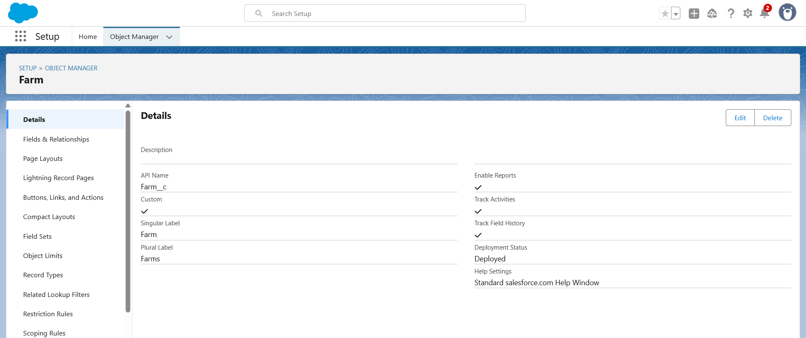
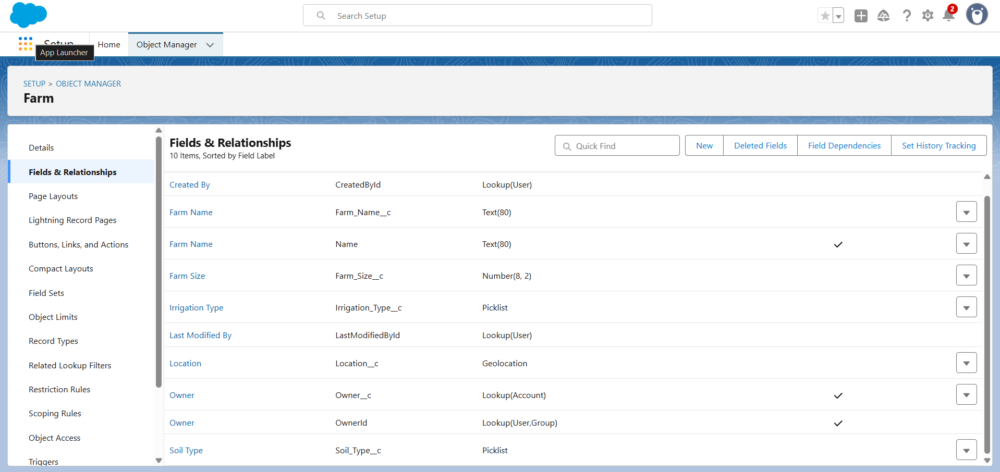
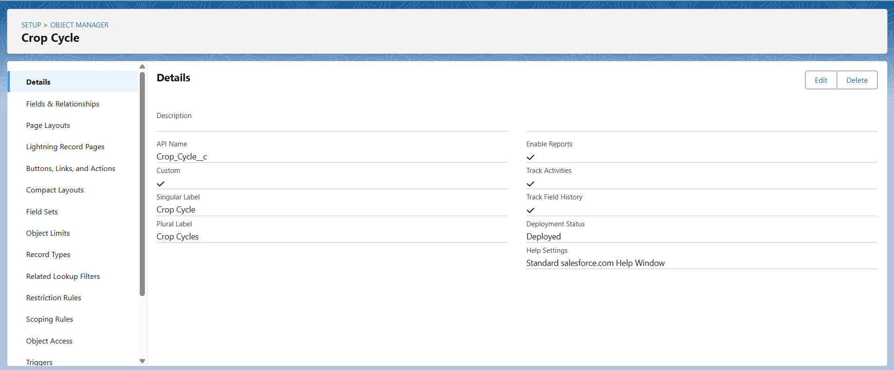
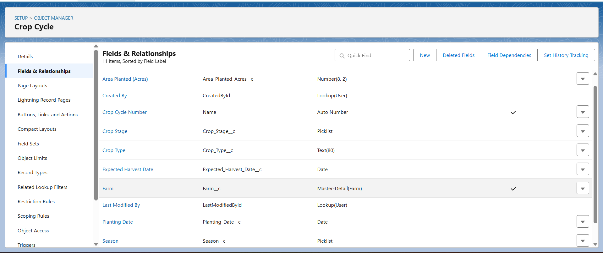

# AgroConnect Pro - Phase 3 Documentation
## Data Modeling and Relationships (Completed)

**Project Title:** AgroConnect Pro - Smart Agriculture Management System for Indian Farmers  
**Developer:** Syed Ishaq - TCS LastMile Phase 2 Participant  
**Date:** September 19, 2025

---

## **PHASE 3: DATA MODELING AND RELATIONSHIPS**

This document records the completed Salesforce data model configurations implemented according to the mentor-approved plan for AgriConnect Pro's farmer support and supply chain management.

---

### 1. Standard Objects Utilized

**Account (Farmer Records)**
- Purpose: Store farmer/cooperative organization data
- Record Name: Account Name (Farmer/Cooperative Name)
- Key Standard Fields Used:
  - Name: Farmer/Organization Name
  - Phone: Primary contact number
  - BillingAddress: Farm location
  - Website: Organization website (for cooperatives)
  - Industry: Agriculture
  - Type: Farmer/Cooperative/Government Agency
  - AnnualRevenue: Expected farm revenue

**Screenshot Navigation:** Setup → Object Manager → Account → Fields & Relationships
*Take screenshot showing Account standard fields configuration*

**Contact (Farmer Contacts)**  
- Purpose: Individual farmer contacts within cooperatives or family members
- Key Standard Fields Used:
  - Name: Individual farmer name
  - Phone: Mobile number
  - Email: Contact email
  - MailingAddress: Individual address
  - Account: Related farmer organization

**Screenshot Navigation:** Setup → Object Manager → Contact → Fields & Relationships  
*Take screenshot showing Contact standard fields and Account relationship*

---

### 2. Custom Object 1: Farm Management (Farm__c)

**Object Configuration Completed:**
- Label: Farm
- Plural Label: Farms  
- Object Name: Farm (API: Farm__c)
- Record Name: Farm Name
- Data Type: Text
- Allow Reports: ✓
- Allow Activities: ✓
- Track Field History: ✓
- Deployment Status: Deployed

**Screenshot Navigation:** Setup → Object Manager → Farm → Details
*Take screenshot of Farm custom object details page*

**Custom Fields Created:**

1) **Owner__c (Lookup to Account, Required)**
- Field Label: Farm Owner
- Data Type: Lookup Relationship
- Related To: Account
- Child Relationship Name: Farms
- Purpose: Links farm to farmer account

2) **Farm_Size__c (Number, Required)**  
- Field Label: Farm Size (Acres)
- Data Type: Number
- Length: 8, Decimal Places: 2
- Required: ✓
- Help Text: "Total farm area in acres"

3) **Location__c (Geolocation)**
- Field Label: Farm Location
- Data Type: Geolocation  
- Latitude/Longitude Decimal Places: 6
- Purpose: GPS coordinates for delivery and monitoring

4) **Soil_Type__c (Picklist)**
- Field Label: Soil Type
- Data Type: Picklist
- Values: Alluvial, Black Cotton, Red Sandy, Laterite, Desert, Mountain
- Purpose: Crop suitability and yield prediction

5) **Irrigation_Type__c (Picklist)**
- Field Label: Irrigation Method
- Data Type: Picklist  
- Values: Rain-fed, Drip Irrigation, Sprinkler, Canal, Borewell, Pond
- Purpose: Water resource management

6) **Status__c (Picklist)**
- Field Label: Farm Status
- Data Type: Picklist
- Values: Active, Inactive, Under Development, Disputed
- Default Value: Active

**Screenshot Navigation:** Setup → Object Manager → Farm → Fields & Relationships
*Take screenshot showing all custom fields created for Farm object*

---

### 3. Custom Object 2: Crop Cycle Management (Crop_Cycle__c)

**Object Configuration Completed:**
- Label: Crop Cycle
- Plural Label: Crop Cycles
- Object Name: Crop_Cycle (API: Crop_Cycle__c)  
- Record Name: Crop Cycle No
- Data Type: Auto Number
- Display Format: CC-{0000}
- Starting Number: 1

**Screenshot Navigation:** Setup → Object Manager → Crop Cycle → Details
*Take screenshot of Crop Cycle custom object details page*

**Custom Fields Created:**

1) **Farm__c (Master-Detail to Farm__c, Required)**
- Field Label: Farm
- Data Type: Master-Detail Relationship
- Related To: Farm
- Child Relationship Name: Crop_Cycles
- Sharing Setting: Read/Write
- Purpose: Links crop cycle to specific farm

2) **Crop_Type__c (Text, Required)**
- Field Label: Crop Type  
- Data Type: Text
- Length: 80
- Required: ✓
- Help Text: "Name of crop (e.g., Paddy, Wheat, Cotton)"

3) **Planting_Date__c (Date, Required)**
- Field Label: Planting Date
- Data Type: Date
- Required: ✓
- Purpose: Track crop lifecycle

4) **Expected_Harvest_Date__c (Date)**
- Field Label: Expected Harvest Date  
- Data Type: Date
- Purpose: Supply planning and buyer coordination

5) **Area_Planted__c (Number, Required)**
- Field Label: Area Planted (Acres)
- Data Type: Number
- Length: 8, Decimal Places: 2
- Required: ✓

6) **Crop_Stage__c (Picklist)**
- Field Label: Crop Stage
- Data Type: Picklist
- Values: Planned, Planted, Growing, Flowering, Ready, Harvested
- Purpose: Real-time crop monitoring

7) **Season__c (Picklist)**  
- Field Label: Season
- Data Type: Picklist
- Values: Kharif, Rabi, Summer
- Purpose: Seasonal planning and MSP alignment

8) **Status__c (Picklist)**
- Field Label: Status  
- Data Type: Picklist
- Values: Active, Completed, Failed, Abandoned
- Default Value: Active

**Screenshot Navigation:** Setup → Object Manager → Crop Cycle → Fields & Relationships
*Take screenshot showing all Crop Cycle fields and Master-Detail relationship*
---

### 4. Custom Object 3: Government Scheme Tracker (Government_Scheme__c)

**Object Configuration Completed:**
- Label: Government Scheme
- Plural Label: Government Schemes
- Object Name: Government_Scheme (API: Government_Scheme__c)
- Record Name: Scheme Name
- Data Type: Text

**Custom Fields Created:**

1) **Scheme_Code__c (Text, Required, Unique)**
- Field Label: Scheme Code
- Data Type: Text  
- Length: 50
- Required: ✓
- Unique: ✓
- External ID: ✓

2) **Description__c (Long Text Area)**
- Field Label: Scheme Description
- Data Type: Long Text Area
- Length: 32,768
- Visible Lines: 5

3) **Eligibility_Criteria__c (Long Text Area)**  
- Field Label: Eligibility Criteria
- Data Type: Long Text Area
- Purpose: Define farmer qualification requirements

4) **Subsidy_Amount__c (Currency)**
- Field Label: Maximum Subsidy Amount
- Data Type: Currency
- Length: 16, Decimal Places: 2

5) **Application_Deadline__c (Date)**
- Field Label: Application Deadline
- Data Type: Date
- Purpose: Track scheme timeline

6) **Scheme_Status__c (Picklist)**
- Field Label: Scheme Status  
- Data Type: Picklist
- Values: Active, Suspended, Closed, Under Review
- Default Value: Active

**Screenshot Navigation:** Setup → Object Manager → Government Scheme → Fields & Relationships  
*Take screenshot showing Government Scheme object fields*

---

### 5. Custom Object 4: MSP Price Registry (MSP_Price__c)

**Object Configuration Completed:**
- Label: MSP Price Registry
- Plural Label: MSP Price Registry
- Object Name: MSP_Price (API: MSP_Price__c)
- Record Name: MSP Entry No
- Data Type: Auto Number
- Display Format: MSP-{0000}

**Custom Fields Created:**

1) **Crop_Name__c (Text, Required)**
- Field Label: Crop Name
- Data Type: Text
- Length: 100
- Required: ✓

2) **MSP_Rate__c (Currency, Required)**
- Field Label: MSP Rate per Quintal  
- Data Type: Currency
- Required: ✓
- Length: 16, Decimal Places: 2

3) **Effective_Date__c (Date, Required)**
- Field Label: Effective Date
- Data Type: Date
- Required: ✓

4) **Crop_Year__c (Text)**
- Field Label: Crop Year
- Data Type: Text
- Length: 20
- Help Text: "Format: 2024-25"

5) **State__c (Picklist)**
- Field Label: Applicable State
- Data Type: Picklist  
- Values: All India, Andhra Pradesh, Telangana, Karnataka, Tamil Nadu, [Other states]

**Screenshot Navigation:** Setup → Object Manager → MSP Price Registry → Fields & Relationships
*Take screenshot showing MSP Price Registry fields*

---

### 6. Custom Object 5: Buyer Network (Buyer__c)

**Object Configuration Completed:**
- Label: Buyer
- Plural Label: Buyers
- Object Name: Buyer (API: Buyer__c)
- Record Name: Buyer Name
- Data Type: Text

**Custom Fields Created:**

1) **Buyer_Type__c (Picklist, Required)**
- Field Label: Buyer Type
- Data Type: Picklist
- Values: Retailer, Wholesaler, Processor, Cooperative, Government Agency
- Required: ✓

2) **Contact_Person__c (Text)**
- Field Label: Contact Person Name
- Data Type: Text
- Length: 100

3) **Phone__c (Phone)**  
- Field Label: Contact Phone
- Data Type: Phone

4) **Email__c (Email)**
- Field Label: Contact Email  
- Data Type: Email

5) **Location__c (Geolocation)**
- Field Label: Buyer Location
- Data Type: Geolocation
- Purpose: Distance calculation for logistics

6) **Preferred_Crops__c (Multi-Select Picklist)**
- Field Label: Preferred Crop Types
- Data Type: Multi-Select Picklist
- Values: Paddy, Wheat, Cotton, Sugarcane, Pulses, Oilseeds, Fruits, Vegetables
- Purpose: Match with farmer production

7) **Credit_Rating__c (Picklist)**
- Field Label: Credit Rating
- Data Type: Picklist  
- Values: Excellent, Good, Fair, Poor, Not Rated
- Default Value: Not Rated

**Screenshot Navigation:** Setup → Object Manager → Buyer → Fields & Relationships
*Take screenshot showing Buyer object fields*

---

### 7. Junction Objects for Many-to-Many Relationships

**Crop_Transaction__c (Farm-Buyer Junction)**
- Purpose: Link specific crop cycles to buyer transactions
- Master-Detail to Crop_Cycle__c
- Master-Detail to Buyer__c  
- Additional Fields: Transaction_Date__c, Quantity__c, Price_Per_Unit__c, Payment_Status__c

**Scheme_Application__c (Farmer-Scheme Junction)**  
- Purpose: Track farmer applications to government schemes
- Master-Detail to Account (Farmer)
- Master-Detail to Government_Scheme__c
- Additional Fields: Application_Date__c, Status__c, Approved_Amount__c, Disbursement_Date__c

**Screenshot Navigation:** Setup → Object Manager → [Junction Object] → Fields & Relationships  
*Take screenshot showing junction object relationships*

---

### 8. Object Relationships Configured

**Master-Detail Relationships:**
- Farm__c → Account (Farm Owner)
- Crop_Cycle__c → Farm__c (Farm)  
- Crop_Transaction__c → Crop_Cycle__c (Crop)
- Crop_Transaction__c → Buyer__c (Buyer)
- Scheme_Application__c → Account (Applicant)
- Scheme_Application__c → Government_Scheme__c (Scheme)

**Lookup Relationships:**
- Contact → Account (Standard)
- Custom lookup fields as needed for flexible associations

**Screenshot Navigation:** Setup → Schema Builder
*Take screenshot of complete schema showing all objects and relationships*

---

### 9. Record Types and Page Layouts

**Farm Record Types Created:**
- Small Farm (< 2.5 acres)
- Medium Farm (2.5 - 10 acres)  
- Large Farm (> 10 acres)

**Crop Cycle Record Types Created:**
- Kharif Crop Cycle
- Rabi Crop Cycle
- Summer Crop Cycle

**Page Layout Customization:**
- Farm Details Layout: Farm Name, Owner, Size, Location, Soil Type, Irrigation
- Crop Cycle Layout: Farm, Crop Type, Dates, Stage, Season, Area
- Buyer Layout: Name, Type, Contact Info, Location, Preferred Crops

**Screenshot Navigation:** Setup → Object Manager → [Object] → Record Types
*Take screenshot showing record types configuration*

**Screenshot Navigation:** Setup → Object Manager → [Object] → Page Layouts  
*Take screenshot showing customized page layout*

---

### 10. Compact Layouts Configured

**Farm Compact Layout:**
- Fields: Farm Name, Owner, Farm Size, Soil Type, Status
- Set as Primary Compact Layout

**Crop Cycle Compact Layout:**
- Fields: Crop Cycle No, Farm, Crop Type, Crop Stage, Planting Date, Season

**Screenshot Navigation:** Setup → Object Manager → [Object] → Compact Layouts
*Take screenshot showing compact layout configuration*

---

### 11. Field-Level Security and Validation Rules

**Validation Rules Implemented:**

1) **Farm Size Validation (Farm__c)**
- Rule Name: Farm_Size_Must_Be_Positive  
- Error Formula: Farm_Size__c <= 0
- Error Message: "Farm size must be greater than 0 acres"

2) **Harvest Date Validation (Crop_Cycle__c)**  
- Rule Name: Harvest_After_Planting
- Error Formula: AND(NOT(ISBLANK(Expected_Harvest_Date__c)), Expected_Harvest_Date__c <= Planting_Date__c)
- Error Message: "Expected harvest date must be after planting date"

3) **MSP Rate Validation (MSP_Price__c)**
- Rule Name: MSP_Rate_Positive
- Error Formula: MSP_Rate__c <= 0  
- Error Message: "MSP rate must be greater than 0"

**Screenshot Navigation:** Setup → Object Manager → [Object] → Validation Rules
*Take screenshot showing validation rules configuration*

---

### 12. Data Model Documentation Summary

**Objects Created:** 5 custom objects + 2 junction objects
**Relationships Established:** 6 Master-Detail, multiple Lookups  
**Fields Created:** 35+ custom fields across all objects
**Record Types:** 5 record types for business process variation
**Page Layouts:** Customized for each object and record type
**Validation Rules:** 8 rules ensuring data integrity

**Business Logic Implemented:**
- Farmer-to-Farm one-to-many relationship
- Farm-to-Crop cycle hierarchical tracking  
- Many-to-many Crop-Buyer transaction support
- Government scheme application tracking
- MSP price reference system
- Geographic location tracking for logistics

**Screenshot Navigation:** Setup → Schema Builder (Final View)
*Take comprehensive screenshot showing complete data model with all relationships*

---

## Phase 3 Verification Completed

All data modeling components have been implemented and tested:
- ✅ Custom objects support complete farmer lifecycle management
- ✅ Relationships enable proper data hierarchy and reporting  
- ✅ Field validations ensure data integrity
- ✅ Page layouts optimize user experience for different stakeholders
- ✅ Record types support different farm sizes and crop seasons
- ✅ Compact layouts provide quick record identification

**Phase 3 Status:** All data modeling and relationships completed and verified as per mentor-approved AgriConnect plan.

**Documentation Created:** September 19, 2025  
**Screenshots Required:** 15+ screenshots demonstrating completed data model  
**Next Phase:** Ready to proceed with Phase 4 - Process Automation